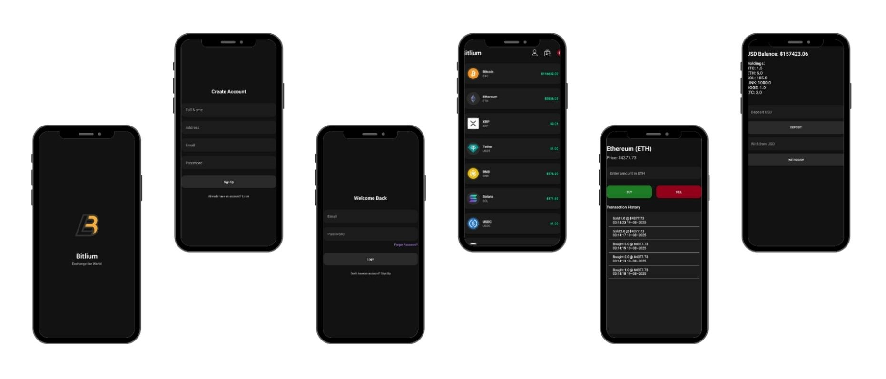

#  Bitlium – Crypto Trading Simulator

Bitlium is an **Android-based cryptocurrency trading simulator** that integrates **CoinGecko API** for live crypto data, **Firebase Authentication** for secure login/signup, and **SharedPreferences** for local storage of user transactions.  
It provides a simple, beginner-friendly interface to **browse coins, view prices, and simulate buy/sell trades**.

---

## ✨ Features

- 🔑 **User Authentication**
    - Login & Signup using Firebase Authentication
    - Secure session management

- 📊 **Live Crypto Dashboard**
    - Fetches top 25 cryptocurrencies by market cap
    - Real-time prices, names, and coin logos from **CoinGecko API**
    - Smooth scrolling list with RecyclerView

- 💱 **Trading Simulation**
    - Buy & Sell crypto (simulated via Toast confirmations)
    - Enter desired amount before placing a trade
    - Stores all buy/sell transactions in **SharedPreferences**

- 🖼 **Coin Details**
    - Coin image, name, symbol, and current price displayed dynamically

---

## 🛠 Tech Stack

- **Java (Android)** – Core application
- **Retrofit + Gson** – API integration
- **Glide** – Image loading
- **Firebase Authentication** – User login & signup
- **CoinGecko API** – Live cryptocurrency market data
- **SharedPreferences** – Local storage for transactions and balances

---

## ⚙️ Setup & Installation

1. **Clone the repository**
   ```bash
   git clone https://github.com/your-username/bitlium.git
   cd bitlium

2. **Open in Android Studio**
- Open the project folder in **Android Studio**
- Allow **Gradle** to sync the dependencies automatically

3. **Configure Firebase**
- Go to [Firebase Console](https://console.firebase.google.com/)
- Create a **new project**
- Add an Android app with package name:  
  **com.example.bitlium**
- Download the `google-services.json` file
- Place it inside the `app/` directory
- Enable **Email/Password Authentication** in Firebase Authentication
 
4. Run the App
- Connect your **Android device** or start an **emulator**
- Click ▶️ **Run** in Android Studio to launch the app  


## 📸 Screenshots




## 👨‍💻 Author
Developed by **Khizar Ameer**  
💌 Reach me at: [khizrr.ameer@gmail.com](mailto:khizrr.ameer@gmail.com)  

